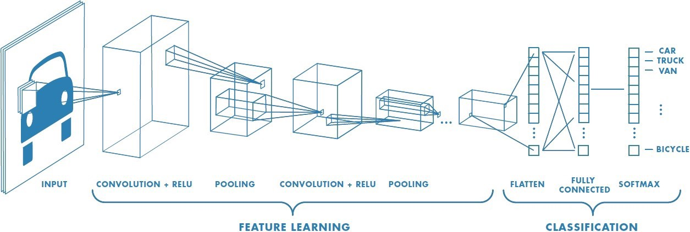

# Facial_Expression_Recognition_OpenCV_Keras
Facial Expression Recognition is an application of Computer Vision, a boon of AI, which enables the computer recognise a pwerson's emotion on the basis of his/her facial expression. Its main applcations are listed below:
## Applications:
<ul>
<li>It can be used to detect the predominant emotion of a person while doing a particular activity like giving a lecture, watching a video, reading a post, etc.</li>
<li>It can be used to find how funny or emotional a particular video, or post, or image is by determing the facial expression of many people.</li>
<li>It can be used to detect mental disorders.</li>
<li>It can help prevent riots by detecting the anger emotion among multiple people.</li>
<li>It help the human users monitor their stress level.</li>
<li>It can help AI assistants to recommend videos or songs or say things according to the emotion of the user, like cheering them when they are sad and sounding happy,when a person is happy. This way, we can create good AI friends and help remove loneliness from people's lives.</li>
</ul>

## Aim of this project:
Training a convolutional neural network to recognise 7 kinds of emotions (Happy, Anger, Sad, Fear, Disgust, Surprise, Neutral) after detection of face in real time video camera and giving the prediction.
## The dataset used for training and testing the model:
It consists of the training (28,709 images) and the testing (7,178 images) set comprising of images of people's faces with the 7 kinds of expressions mentioned above.
The class-distribution of the training set is as follows:
<ol>
  <li>3171 surprise images</li>
  <li>7215 happy images</li>
  <li>4965 neutral images</li>
  <li>3995 angry images</li>
  <li>4830 sad images</li>
  <li>436 disgust images</li>
  <li>4097 fear images</li>
</ol>
 

 
<h2>A brief dicussion of Convolutional Neural Networks:</h2>

In neural networks, Convolutional neural network (ConvNets or CNNs) is one of the main categories to do images recognition, images classifications. Objects detections, recognition faces etc., are some of the areas where CNNs are widely used. CNN's work on the principle of extracting low-level features in the earlier layers, like edges in the image, to more complex features in the deeper layers using complex mathematical operations (called convolving) on the pixel values of the given image using mathematical entities called filters.

Convolutional Neural Networks have 2 main components:
<ol>
  <li><b>Feature learning:</b> you can see convolution, ReLU,Pooling layer phases here. Edges,shades,lines,curves, in this Feature learning step are get extracted.</li>
  <li><b>Classification</b>:you see Fully Connected(FC) layer in this phase. They will assign a probability for the object on the image being what the algorithm predicts it is.</li>
 </ol>
For more detailed information on CNNs refer to this <a href=https://medium.com/@purnasaigudikandula/a-beginner-intro-to-convolutional-neural-networks-684c5620c2ce>link</a>

# Our model

 
This model has ben taken from a <a href=http://cs231n.stanford.edu/reports/2016/pdfs/005_Report.pdf>research paper</a> by Stanford University on finding the best model for facial expression recognition. It consists of 4 convolutional blocks, each comprising of   
<ol>
  <li><b>Convolutional layer</b> of a number of filters (increaing by powers of 2 in each layer) for feature extraction</li>
  <li><b>Batch Normalisation</b> for normalising the inputs fed into the next layer for avoiding covariate shift.</li>
  <li><b>Maxpooling</b> for extracting the most prominent feature in the feature maps produced after applying the convolution operations and reducing the spatial size of the representation to reduce the amount of parameters and computation in the network</li>
  <li><b>Rectified Linear Unit Activation Function</b> for allowing the model to create complex mappings between the network’s inputs and outputs, which are essential for learning and modeling complex data, such as images and data sets like these which are non-linear and have high dimensionality.</li>

# Loss functions, validation accuracy

